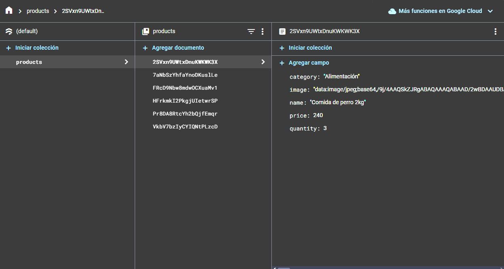
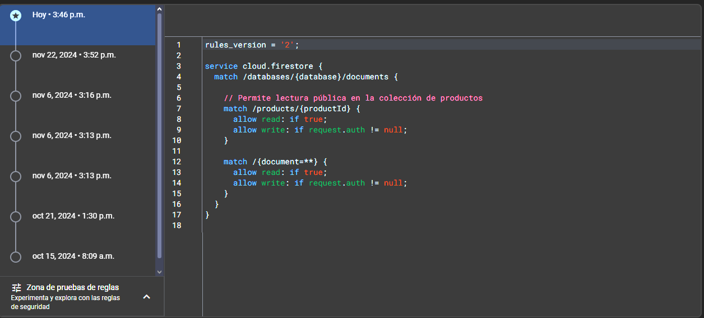
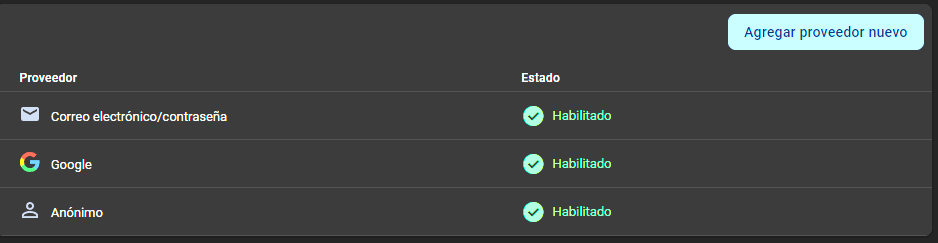

Se cambio la estructura del proyecto, agregando modulos y archivos index para tener mejor escalabilidad.
Alvaro Renan Ek Lugo encargado de la base de datos que se mande los productos y se muestren y que tambien se crean los usuarios y se guarden en la base de datos

Jose Raul Brito Argaez encargado de funcionalidad: que funciones todos los botones y que el programa funcione de manera correcta y que no tenga fallos al momento que se utilize y que este bien estructurado y organizado 

Diego Alberto López  Arana Encargado de dar estilos a la pagina 

Jesus Emanuel Tamayo Pech Encargado de hacer los modales de la pagina y ademas de las confirmaciones de la página

Victor Manuel Aranda Rodriguez Se encargo de reforzar los estilos de la pagina y que sea responsivo 

Temas abordados dentro del codigo:
Zod
UseEffect
useContext
useContext
useReducer
Hooks
React Router
useNavigate
useParams
useLocation
Fetch
Se uso firebase para crear la base de datos

pruebas que se creo la base de datos en firebase:

